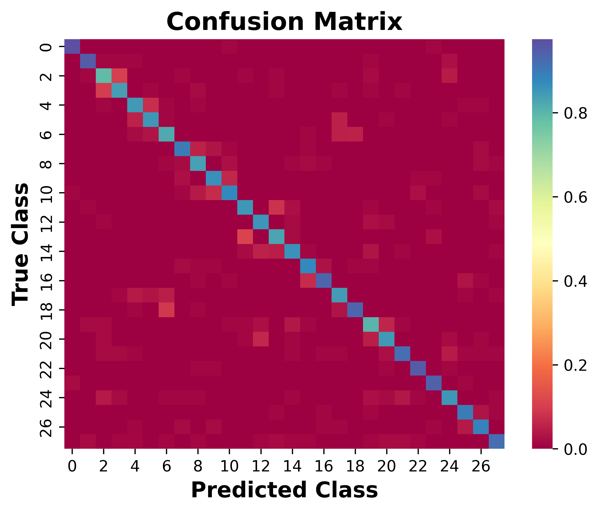

# Pytorch-Arabic-Handwritten-Characters
Using convolutional neural network for Arabic handwritten characters recognition ([Kaggle competition](https://www.kaggle.com/datasets/mloey1/ahcd1))

## Usage

First you should download the dataset from the [kaggle website](https://www.kaggle.com/datasets/mloey1/ahcd1). And make sure that the directories is like this: 

```sh
├─archive
│  ├─Arabic Handwritten Characters Dataset CSV
│  ├─Test Images 3360x32x32
│  │  └─test
│  └─Train Images 13440x32x32
│      └─train
└─ .gitignore
   ArabicCharactersDataset.py
   archive.zip
   Confusion_Matrix.png
   main.ipynb
   model.py
   predict.py
   README.md
   train.py
```

Then train the network twice (for better performance)
```sh
python train.py
# wait for training ...
python train.py  # once again with smaller learning rate
```

Then apply the network in the testing dataset
```sh
python predict.py
```
it is expected to generate a confusion matrix figure (in png) and print the accuracy, precision, recall and f1 score. 




## Reference 

- He K, Zhang X, Ren S, et al. Deep residual learning for image recognition[C]//Proceedings of the IEEE conference on computer vision and pattern recognition. 2016: 770-778.